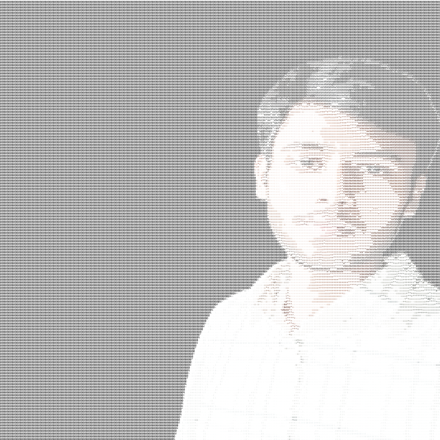
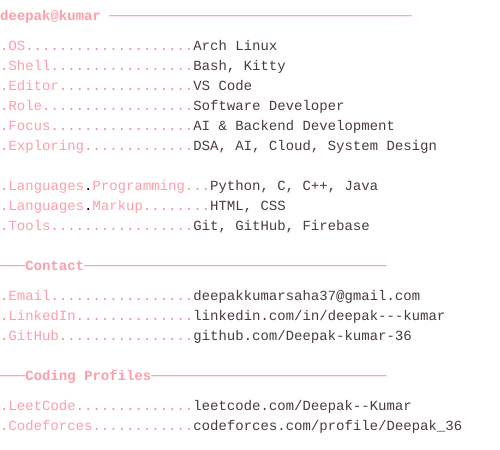

 

<table>
<tr>
<td valign="top" align="center">

</td>
<td valign="top">

</td>
</tr>
</table>

### 🌸 Launch the Interactive Terminal 🌸

**[deepak-kumar-36.github.io →](https://deepak-kumar-36.github.io/)**
*type `help` or `hanami` once it boots up.*

 

## 🛠️ Tech Stack

  
  
  
  
  
  
  

  
  
  
  
  
  

  <em>currently exploring</em> 
  
  
  
  

## 🚀 Featured Projects

<table>
<tr>
<td width="50%" valign="top">

**RailMind**
AI-powered railway safety and emergency response platform — cloud infra plus intelligent automation for real-time incident response.

[`github.com/Deepak-kumar-36/RailMind`](https://github.com/Deepak-kumar-36/RailMind)

</td>
<td width="50%" valign="top">

**Leveling Up**
A self-improvement and habit-tracking platform — set goals, build streaks, and track progress across different areas of life.

[`github.com/Deepak-kumar-36/LevelingUp`](https://github.com/Deepak-kumar-36/LevelingUp)

</td>
</tr>
</table>

 

## 📩 Contact

  
  
  
  

